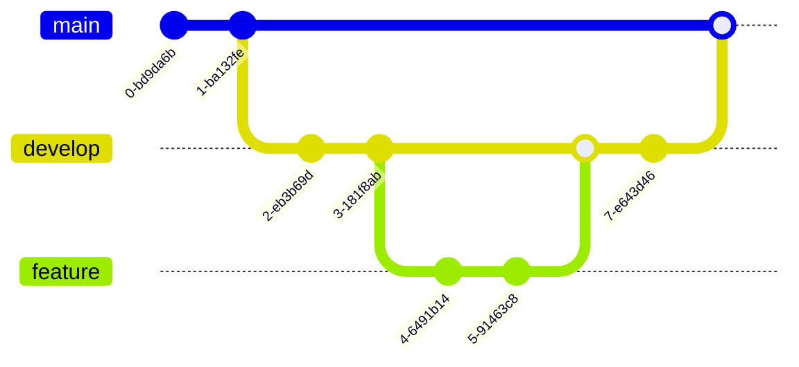

# ODS MLOps sample repo

Линттнг и форматирование осуществляется с помощью ruff.

## Как запустить

Install [pdm](https://daobook.github.io/pdm/)

Установить зависимости:
```
pdm install --no-self --prod
```

Для разработки:
```
pdm install --no-self -d
```

pre commit hooks:
```
pre-commit install
```

### Сборка образа

```
docker build -t app .
```

Запуск:
```
docker run --rm -t app
```

### PyPi

[https://test.pypi.org/project/ods-mlops/](https://test.pypi.org/project/ods-mlops/)

### Image registry

[https://github.com/KernelA/ods-mlops-2024/pkgs/container/ods-mlops-2024](https://github.com/KernelA/ods-mlops-2024/pkgs/container/ods-mlops-2024)

## Загрузка данных:
```
kaggle datasets download -d new-york-city/ny-2015-street-tree-census-tree-data --unzip -p ./data/raw
```

## Snakemake

Запуск pipeline в Snakemake:
```
snakemake --cores
```

## quarto

Для получения HTML вывода из notebook:
```
snakemake --cores --report ./report/snake.html
quarto render
```

## Kubernetes

[Nginx ingress](info/kubernetes.md)

## Работа с ветками

main - стабильная ветка, develop - экспериментальная ветка, feature - изменения.



