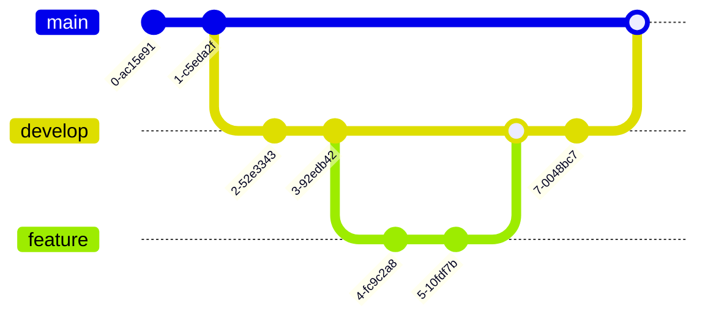

# ODS MLOps sample repo

Линтер и форматтирование осуществляется с поомщью ruff.

## Как запустить

Install [pdm](https://daobook.github.io/pdm/)

Установить зависимости:
```
pdm install --no-self --prod
```

Для разработки:
```
pdm install --no-self -d
```

## Работа с ветками

main - стабильная ветка, develop - экспериментальная ветка, feature - изменения.



